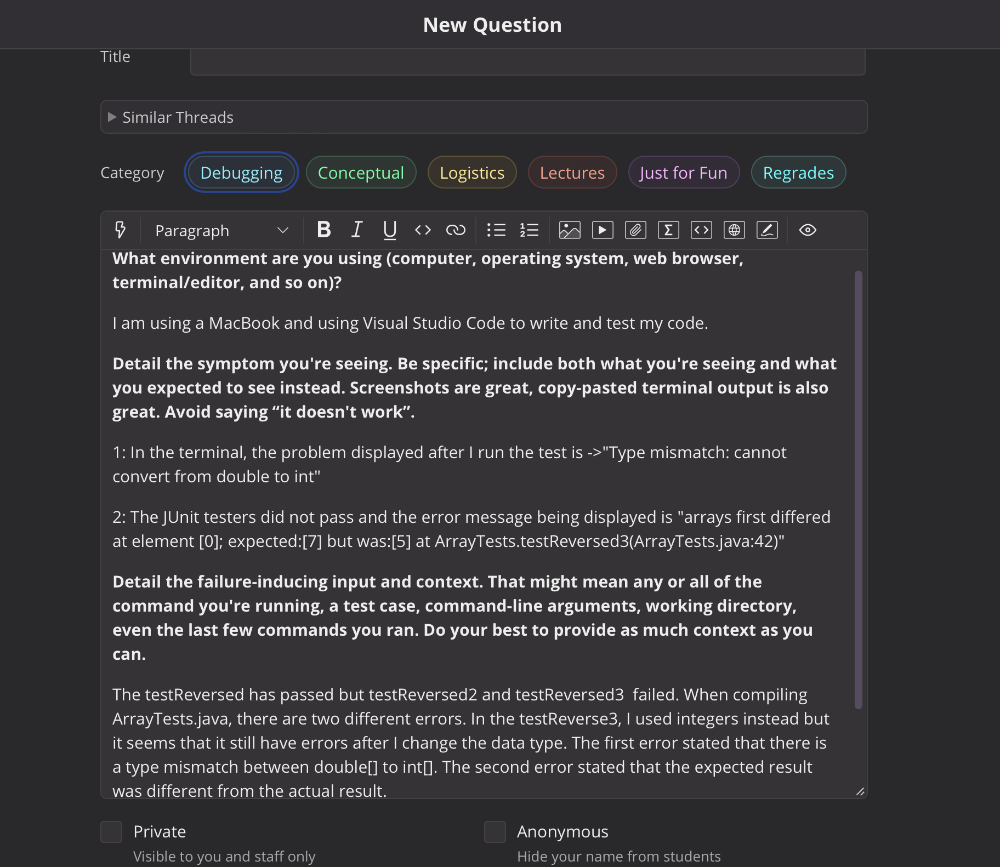
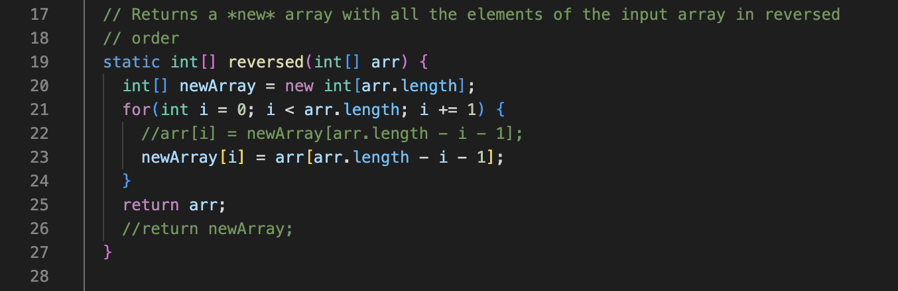
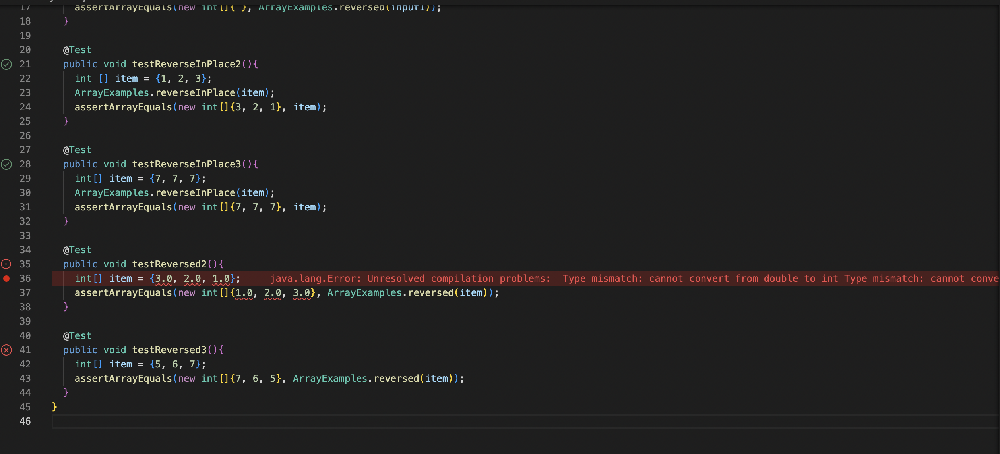
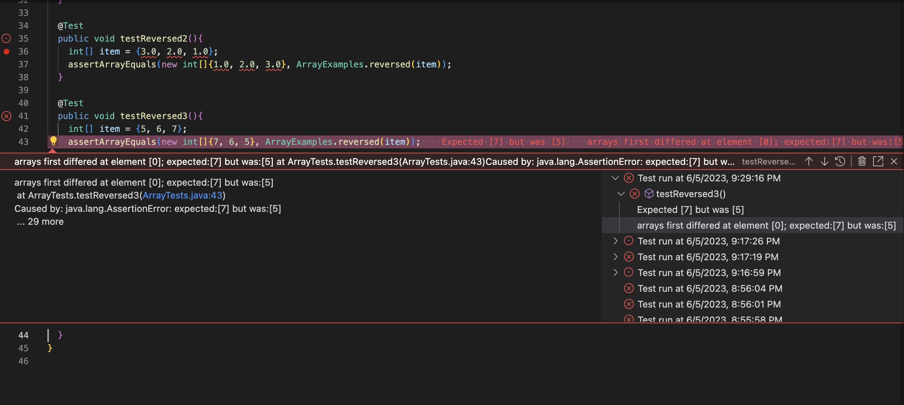
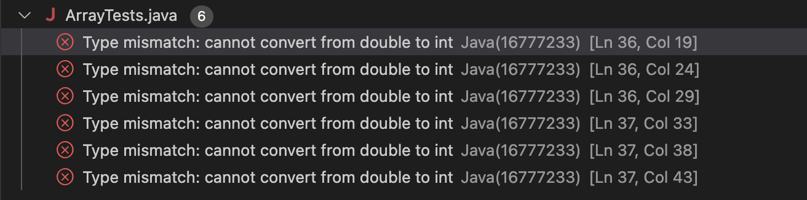
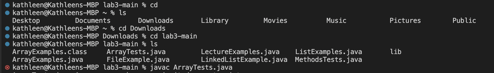
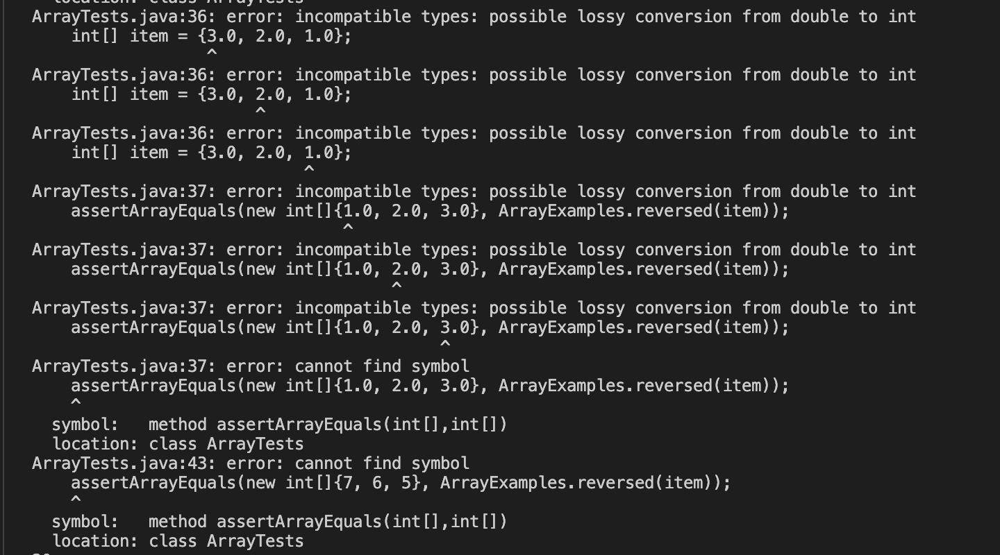

# Lab Report 5: Debugging and Reflection 
This lab report will go over on how to debug an error in a coding scenario and reflecting on the course's lab experience. 

## **Debugging Scenario**
### Student Post: 


### **Errors/Symptoms**
***Reversed Method From ArrayExamples.java file*** <br />


***Tests in JUnit*** <br />
1. Error in testReversed2 <br />


2. Error in testReversed3 <br />


***Problem: Error Message in JUnit Testing*** <br />


***Output In the Terminal:*** <br />



### Student's Post Analysis
After observing the code and screenshots of the student's error, the symptom, bug, and failure-inducing inputs are found. 
- [ ] ***Symptom:*** 1: There is a type mismatch as the method reversed cannot convert the data input from a double[] to int[]. 2: The expected output does not match the actual output after the method reversed is being called. 
- [ ] ***Bug:*** The bug stems from line 25.
- [ ] ***Failure-Inducing Input:*** comes from the tester file of JUnit in the testReversed 2 and testReversed3. 

### Response from a TA: 
After checking your reversed method in ArrayExamples.java, it is true that this method takes in inputs in the type of an integer array only as your parameter has stated ```int[] arr```. In addition, your return statement is returning the wrong array in line 25 within the reversed method. 

To address your first error, the arguments you passed inside the testReverse2 were elements of a double. In line Although you have changed the error in the for loop to assign the new elements of the newly created that is named as `newArray` to hold elements from the condition embedded for the input array `arr`, you did not update the return statement outside of the for loop. Instead of `return arr` in line 25, you should change it to `return newArray` as it is the newly created int[] that holds the elements in the order that the method has intended to do. 
Regarding the first error that occurred
